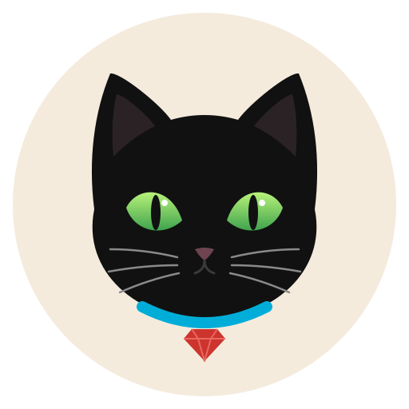

<p align="center">
  
</p>

# cat

A small programming language with Ruby's syntax and Go's semantics.

`cat` compiles to Go source and hands it to the Go toolchain, so it inherits
goroutines, channels, the garbage collector, native binaries and cross
compilation without implementing any of them.

```ruby
def worker(id : Int, jobs : Channel(Int), results : Channel(String))
  jobs.each do |job|
    results << "worker #{id} finished job #{job}"
  end
end

jobs = Channel(Int).new(16)
results = Channel(String).new(16)

3.times do |i|
  spawn do
    worker(i, jobs, results)
  end
end
```

## Install

cat generates Go and builds it, so **the Go toolchain (1.22 or newer) is
required** at compile time. Programs you build are ordinary static binaries
with no dependency on Go or on cat.

The compiler is called `catc`, not `cat`, so that it does not shadow
`/bin/cat`.

```sh
# with Go installed
go install github.com/mehedikhan/cat/cmd/catc@latest

# or a prebuilt binary
curl -fsSL https://raw.githubusercontent.com/mehedikhan/cat/main/install.sh | sh

# or from a clone
git clone https://github.com/mehedikhan/cat && cd cat
sudo make install                  # /usr/local/bin
make install PREFIX=$HOME/.local   # no sudo
```

Then check your setup:

```
$ catc doctor
catc      v1.0.0 (darwin/arm64)
installed /usr/local/bin/catc
go        go1.24.0
          /opt/homebrew/bin/go

everything looks good
```

## Usage

```
catc run   examples/workers.cat   # compile and run
catc build examples/workers.cat   # write a native executable
catc emit  examples/workers.cat   # print the generated Go
catc doctor                       # check the toolchain
```

`.cat` files can also be run directly as scripts:

```ruby
#!/usr/bin/env catc
puts "hello from a script"
```

```
$ chmod +x hello.cat && ./hello.cat
hello from a script
```

## The language, as it stands

### Values and variables

```ruby
n = 42                  # inferred
pi = 3.14
name = "cat"
ok = true

count : Int = 0         # explicit type
xs : Array(String) = [] # required when a literal is empty
```

Types are `Int`, `Int64`, `Float`, `String`, `Bool`, `Byte`, `Bytes`,
`Array(T)`, `Channel(T)`, and any struct you declare.

### Strings

Double quotes with `#{}` interpolation, lowered to `fmt.Sprintf`.

```ruby
puts "hello, #{name}! #{2 + 2} == 4"
```

### Functions

Parameters and results are annotated Crystal-style. A trailing expression is
an implicit return.

```ruby
def add(a : Int, b : Int) : Int
  a + b
end

def greet(who : String)   # no result type
  puts "hi #{who}"
end
```

### Control flow

```ruby
if n > 10
  puts "big"
elsif n > 5
  puts "medium"
else
  puts "small"
end

puts "negative" if n < 0
puts "nonzero" unless n == 0

while n > 0
  n = n - 1
end
```

### Blocks and iteration

Blocks are lowered to `for` loops rather than closures, so `break` and `next`
behave the way a Ruby programmer expects.

```ruby
3.times do |i| ... end
xs.each do |x| ... end
xs.each_with_index do |x, i| ... end
(1..10).each do |i| ... end     # .. includes 10, ... excludes it
```

### Structs

Fields are declared with types; `@name` is the instance variable, which is
`self.name` in the generated Go. Methods take pointer receivers, so they can
mutate.

```ruby
struct Point
  x : Float
  y : Float

  def dist(other : Point) : Float
    dx = @x - other.x
    dy = @y - other.y
    Math.sqrt(dx * dx + dy * dy)
  end
end

a = Point.new(0.0, 0.0)          # positional
b = Point.new(x: 3.0, y: 4.0)    # named
puts a.dist(b)
```

A method taking no arguments may be called without parentheses (`a.to_str`)
as long as no struct declares a field with that name.

### Concurrency

```ruby
ch = Channel(Int).new(8)   # make(chan int, 8)
ch << 1                    # send
v = ch.receive             # receive
ch.close
ch.each do |v| ... end     # range over the channel until closed

spawn do ... end           # goroutine
defer do ... end           # deferred call
```

`<<` is a channel send on a `Channel(T)` and an append on an `Array(T)`. The
compiler needs to know which, so annotate a variable it cannot infer.

### Built-ins

`puts`, `print`, `p` (call without parentheses), `.size` / `.length`,
`.push(x)`, `.to_s`, `.upcase`, `.downcase`, `.strip`, `.split(sep)`,
`.join(sep)`, `.include?(s)`, and `Math.sqrt` / `abs` / `floor` / `ceil` /
`pow` / `max` / `min` / `round` / `sin` / `cos` / `tan` / `log`, `Math.pi`.

## How it works

A full walkthrough of the compiler — every stage, the hard problems, and why
they were solved the way they were — is in [HOW_IT_WORKS.md](HOW_IT_WORKS.md).
The short version:

```
.cat source
   │
   ├─ internal/lexer    tokens; newline-terminated statements, #{} segments
   ├─ internal/parser   recursive descent + precedence climbing → AST
   ├─ internal/ast      the syntax tree
   ├─ internal/codegen  Go source text + a Go-line → cat-line map
   ├─ internal/driver   writes a temp module, runs `go build`, rewrites errors
   └─ cmd/catc          the CLI
```

There is no type checker. The Go compiler does that job, and the driver
rewrites its diagnostics onto cat line numbers using the line map, so a type
error reads:

```
$ catc run bad.cat
bad.cat:7: cannot use y (variable of type string) as int value in argument to add
```

The generator writes Go as text with hand-managed indentation rather than
through `go/printer`, precisely so that every line can be recorded in that
map. `go/format` is only used by `catc emit`, where line numbers do not matter.

## Deliberate gaps

Known limits of this version, roughly in the order they are worth fixing:

- **No type checker of its own.** Errors are Go's words, mapped to cat lines.
  Good enough to start; the wrong long-term answer for error quality.
- **User functions need parentheses.** Only `puts`, `print` and `p` may be
  called bare. Full Ruby-style paren-less calls need the whitespace-sensitive
  lexing that Ruby and Crystal do.
- **No `map` / `select` / `reduce`** — they need generics in the emitted Go.
- **No interfaces, modules or mixins**, and no generics in cat itself.
- **No multiple return values and no error handling.** Go's `v, err :=` has
  no cat spelling yet; this is the biggest open design question.
- **No pointers.** Structs are Go values; methods use pointer receivers so
  they can mutate, but passing a struct to a function copies it.
- **No hashes, no modules/imports, one file per program.**
- **Unused locals are suppressed** with a generated `_ = x`, because Ruby
  programmers do not expect an unused variable to be a compile error.

## Releasing

```sh
make test
git tag v1.0.0 && git push origin v1.0.0
```

The `release` workflow cross-compiles for darwin, linux and windows on amd64
and arm64, attaches the archives and `checksums.txt` to a GitHub release, and
prints the checksums. `install.sh` reads that release, and
`packaging/catc.rb` is a Homebrew formula ready to drop into a
`homebrew-tap` repository once the checksums are filled in.

`make dist` does the same build locally, into `dist/`.

## Tests

```
go test ./...
```

`internal/lexer` and `internal/parser` have unit tests; `internal/driver`
compiles and runs every example and asserts its output, and checks that a
deliberate type error is reported against the right `.cat` line.
